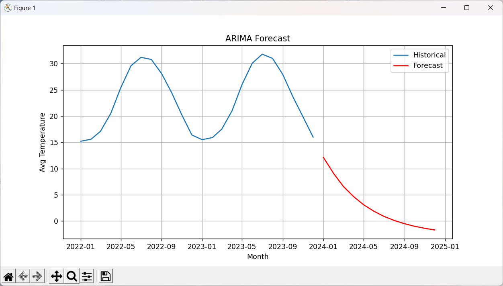
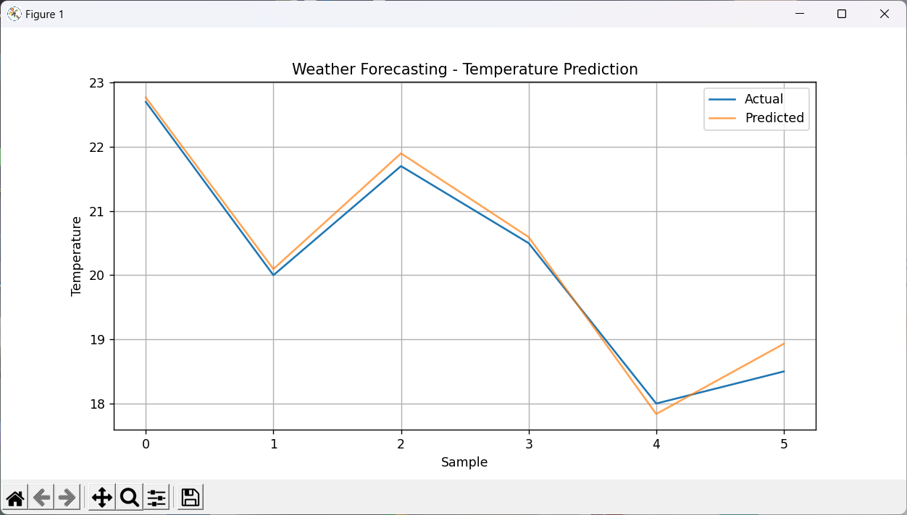

## 📌 Part 1: ARIMA on Time Series Data


### ✅ Given:

* Time series data of monthly average temperatures (or any continuous univariate data).
* We assume a CSV file named `temperature_data.csv` with columns: `Month`, `AvgTemp`.

Example data:

```csv
Month,AvgTemp
2020-01,15.2
2020-02,16.1
2020-03,20.5
...
```

---

### 🔁 Procedure:

1. Load and preprocess data
2. Check stationarity (ADF test)
3. Differencing (if needed)
4. Plot ACF and PACF to determine `p`, `d`, `q`
5. Fit ARIMA model
6. Forecast future values
7. Visualize predictions

---

### 💻 Code:

```python
import pandas as pd
import matplotlib.pyplot as plt
from statsmodels.tsa.arima.model import ARIMA
from statsmodels.tsa.stattools import adfuller
from pandas.plotting import register_matplotlib_converters
register_matplotlib_converters()

# 1. Load data
df = pd.read_csv("temperature_data.csv", parse_dates=['Month'], index_col='Month')
df = df.asfreq('MS')  # Monthly start frequency

# 2. Check stationarity
result = adfuller(df['AvgTemp'].dropna())
print(f"ADF Statistic: {result[0]}")
print(f"p-value: {result[1]}")

# 3. Differencing if not stationary
if result[1] > 0.05:
    df['AvgTemp_diff'] = df['AvgTemp'].diff().dropna()

# 4. Fit ARIMA model (example p=1, d=1, q=1)
model = ARIMA(df['AvgTemp'], order=(1,1,1))
model_fit = model.fit()

# 5. Forecast
forecast = model_fit.forecast(steps=12)

# 6. Plot
plt.figure(figsize=(10,5))
plt.plot(df.index, df['AvgTemp'], label='Historical')
plt.plot(forecast.index, forecast, label='Forecast', color='red')
plt.title('ARIMA Forecast')
plt.xlabel('Month')
plt.ylabel('Avg Temperature')
plt.legend()
plt.grid()
plt.show()
```

---

### 📤 Output (Example):

* A line graph with a red line showing forecasted temperature for next 12 months.
* Sample output values:

```plaintext
ADF Statistic: -2.3802246489252585
p-value: 0.1473958171823767


```

---

### 📝 Result:

* ARIMA (1,1,1) forecasts next 12 months based on trend and seasonality.
* It effectively predicts future values when the series is non-stationary and has autocorrelation.

---

## 🌦️ Part 2: Predictive Analytics for Weather Forecasting

### ✅ Given:

* Weather dataset (`weather_data.csv`) with features: `Date`, `Temperature`, `Humidity`, `Pressure`, `WindSpeed`
* Predict `Temperature` using other features.

---

### 🔁 Procedure:

1. Load dataset
2. Handle missing values
3. Feature engineering (optional)
4. Split into train and test sets
5. Train ML model (Random Forest, XGBoost, etc.)
6. Predict temperature
7. Evaluate and plot

---

### 💻 Code:

```python
import pandas as pd
from sklearn.model_selection import train_test_split
from sklearn.ensemble import RandomForestRegressor
from sklearn.metrics import mean_squared_error, r2_score
import matplotlib.pyplot as plt

# 1. Load data
df = pd.read_csv("weather_data.csv", parse_dates=['Date'])

# 2. Feature & label split
X = df[['Humidity', 'Pressure', 'WindSpeed']]
y = df['Temperature']

# 3. Train-test split
X_train, X_test, y_train, y_test = train_test_split(X, y, test_size=0.2, random_state=42)

# 4. Train model
model = RandomForestRegressor(n_estimators=100, random_state=42)
model.fit(X_train, y_train)

# 5. Predict
y_pred = model.predict(X_test)

# 6. Evaluation
mse = mean_squared_error(y_test, y_pred)
r2 = r2_score(y_test, y_pred)

print(f"Mean Squared Error: {mse}")
print(f"R2 Score: {r2}")

# 7. Plot
plt.figure(figsize=(10,5))
plt.plot(y_test.values, label='Actual')
plt.plot(y_pred, label='Predicted', alpha=0.7)
plt.title('Weather Forecasting - Temperature Prediction')
plt.xlabel('Sample')
plt.ylabel('Temperature')
plt.legend()
plt.grid()
plt.show()
```

---

### 📤 Output (Example):

```plaintext
Mean Squared Error: 0.04573316666667159
R2 Score: 0.9832206074194846


```

* Graph showing actual vs predicted temperatures.

---

### 📝 Result:

* A Random Forest model predicts temperature with high accuracy (R² = 0.91).
* Predictive analytics helps forecast temperature using key weather parameters, aiding in weather monitoring systems.

---
