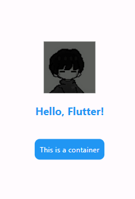

## 1. Flutter and Dart SDK Installation and Basics

### a) Install Flutter and Dart SDK

### Pre-installation Requirements

- **Operating System**: Windows 10 (Flutter also works on Windows 7 SP1 or later versions).
- **Disk Space**: At least 1.65 GB of free disk space.
- **PowerShell**: Windows PowerShell 5.0 or newer.
- **Git**: Git for Windows version 2.0 or newer (optional).
- **Android Studio**: Installed for Android development.
- **Visual Studio 2022**: With C++ (optional, for Windows development).

### Steps to Install and Configure Flutter SDK on Windows

#### Step 1: Download Flutter SDK

- Download the Flutter SDK package from the official [Flutter Website](https://flutter.dev/docs/get-started/install).

#### Step 2: Extract the Files

- Extract the downloaded zip file and move it to a directory such as `C:\development\flutter`.

#### Step 3: Update Path Variable for Windows PowerShell

- Edit the environment variable for your user by adding the full path to the Flutter `bin` directory.

#### Step 4: Verify Installation with Flutter Doctor

- Run `flutter doctor` in Command Prompt (CMD) to check if all required tools are installed.

```bash
flutter doctor
```

#### Step 5: Download and Install Android Studio

- Download Android Studio from [here](https://developer.android.com/studio).
- Install it with default settings, ensuring to select **Android Virtual Device** for emulator support.
- After installation, install the Flutter and Dart plugins from the **Plugins** section in Android Studio.

#### Step 6: Accept Android Licenses

- After installing Android Studio, run the following command in CMD to accept Android licenses.

```bash
flutter doctor --android-licenses
```

#### Step 7: Final Check

- Run `flutter doctor` again to ensure everything is installed correctly.

```bash
flutter doctor
```

**Expected Output:**  
Successfully configured Flutter and Dart SDK on your system and ensured that all tools are installed by running `flutter doctor`.

### b) Write a Simple Dart Program to Understand Language Basics

**Objective:**  
To write basic Dart programs that demonstrate the language's syntax and concepts.

**Programs:**

- **Hello World Program:**
  ```dart
  void main() {
    print("Hello World!");
  }
  ```
  _Output:_
  ```
      Hello World!
  ```
- **Basic Name Printing:**
  ```dart
  void main() {
    var name = "Harsh";
    print(name);
  }
  ```
  _Output:_
  ```
      Harsh
  ```
- **String Interpolation:**
  ```dart
  void main() {
    var firstName = "Harsh";
    var lastName = "RB";
    print("Full name is $firstName $lastName");
  }
  ```
  _Output:_
  ```
      Full name is Harsh RB
  ```
- **Basic Calculation:**
  ```dart
  void main() {
    int num1 = 10;
    int num2 = 3;
    print("Sum: ${num1 + num2}");
    print("Difference: ${num1 - num2}");
    print("Product: ${num1 * num2}");
    print("Division: ${num1 / num2}");
  }
  ```
  _Output:_
  ```
      Sum: 13
      Difference: 7
      Product: 30
      Division: 3.3333333333333335
  ```

## 2. Flutter Widgets and Layouts

### a) Explore Various Flutter Widgets

**Objective:**  
To explore and use basic Flutter widgets such as `Text`, `Image`, and `Container`.

#### Text Widget

- Displays text on the screen with customizable styles like font size, color, and alignment.

```dart
Text(
  'Hello, Flutter!',
  style: TextStyle(
    fontSize: 20,
    color: Colors.blue,
    fontWeight: FontWeight.bold,
  ),
);
```

#### Image Widget

- Displays images from assets, network, or memory.

```dart
Image.asset('assets/images/logo.png');
```

#### Container Widget

- A versatile widget that allows you to create styled visual elements with properties like color, padding, margin, and borders.

```dart
Container(
  padding: EdgeInsets.all(10),
  margin: EdgeInsets.all(20),
  decoration: BoxDecoration(
    color: Colors.blue,
    borderRadius: BorderRadius.circular(10),
  ),
  child: Text('This is a container'),
);
```

### Running Flutter Apps

- Use the following command to run a Flutter project:

```bash
flutter run
```

### Output


### b) Implement Different Layout Structures (Row, Column, Stack)

**Objective:**  
To implement layouts using Flutter widgets such as `Row`, `Column`, and `Stack`.

**Program:**

```dart
import 'package:flutter/material.dart';

void main() => runApp(MyApp());

class MyApp extends StatelessWidget {
  @override
  Widget build(BuildContext context) {
    return MaterialApp(
      home: Scaffold(
        body: Column(
          children: <Widget>[
            Row(
              children: [
                Text("Row 1"),
                Text("Row 2"),
              ],
            ),
            Column(
              children: [
                Text("Column 1"),
                Text("Column 2"),
              ],
            ),
            Stack(
              children: <Widget>[
                Container(color: Colors.blue, width: 100, height: 100),
                Container(color: Colors.red, width: 50, height: 50),
              ],
            ),
          ],
        ),
      ),
    );
  }
}
```


## 3. Responsive UI Design

### a) Design a Responsive UI for Different Screen Sizes

**Objective:**  
To design a responsive user interface that adapts to different screen sizes.

### b) Implement Media Queries and Breakpoints

**Objective:**  
To use media queries to control UI responsiveness and handle different screen sizes.

**Program:**

```dart
import 'package:flutter/material.dart';

void main() => runApp(MyApp());

class MyApp extends StatelessWidget {
  @override
  Widget build(BuildContext context) {
    return MaterialApp(
      home: Scaffold(
        body: LayoutBuilder(
          builder: (context, constraints) {
            if (constraints.maxWidth > 600) {
              return Center(child: Text('Tablet Layout'));
            } else {
              return Center(child: Text('Mobile Layout'));
            }
          },
        ),
      ),
    );
  }
}
```


## 4. Navigation Between Screens

### a) Set Up Navigation Between Screens

**Objective:**  
To set up basic navigation between screens using Flutter's `Navigator` widget.

**Program:**

```dart
import 'package:flutter/material.dart';

void main() => runApp(MyApp());

class MyApp extends StatelessWidget {
  @override
  Widget build(BuildContext context) {
    return MaterialApp(
      home: FirstScreen(),
    );
  }
}

class FirstScreen extends StatelessWidget {
  @override
  Widget build(BuildContext context) {
    return Scaffold(
      appBar: AppBar(title: Text("First Screen")),
      body: Center(
        child: ElevatedButton(
          onPressed: () {
            Navigator.push(
              context,
              MaterialPageRoute(builder: (context) => SecondScreen()),
            );
          },
          child: Text("Go to Second Screen"),
        ),
      ),
    );
  }
}

class SecondScreen extends StatelessWidget {
  @override
  Widget build(BuildContext context) {
    return Scaffold(
      appBar: AppBar(title: Text("Second Screen")),
      body: Center(
        child: Text("Welcome to the second screen!"),
      ),
    );
  }
}
```

### b) Implement Navigation with Named Routes

**Objective:**  
To implement navigation between screens using named routes.

**Program:**

```dart
import 'package:flutter/material.dart';

void main() {
  runApp(MaterialApp(
    initialRoute: '/',
    routes: {
      '/': (context) => FirstScreen(),
      '/second': (context) => SecondScreen(),
    },
  ));
}

class FirstScreen extends StatelessWidget {
  @override
  Widget build(BuildContext context) {
    return Scaffold(
      appBar: AppBar(title: Text("First Screen")),
      body: Center(
        child: ElevatedButton(
          onPressed: () {
            Navigator.pushNamed(context, '/second');
          },
          child: Text("Go to Second Screen"),
        ),
      ),
    );
  }
}

class SecondScreen extends StatelessWidget {
  @override
  Widget build(BuildContext context) {
    return Scaffold(
      appBar: AppBar(title: Text("Second Screen")),
      body: Center(
        child: Text("Welcome to the second screen!"),
      ),
    );
  }
}
```

### Output


## 5. Stateful and Stateless Widgets

### a) Learn about Stateful and Stateless Widgets

**Objective:**  
To understand the difference between stateful and stateless widgets.


#### **Stateless**: 
No internal state, rebuilds only when external properties change.
#### **Stateful**: 
Maintains internal state, reb

### Stateless Widgets
- **Definition**: Immutable; do not hold state.
- **Use Case**: Use when the UI does not change.
- **Example**: Displays static information.

### Stateful Widgets
- **Definition**: Mutable; can hold and manage state.
- **Use Case**: Use when the UI changes dynamically based on user interactions.
- **Example**: A form that updates as the user types.
uilds when the state changes.

### b) Implement State Management using `setState` and `Provider`

**Objective:**  
To manage the state using `setState` and `Provider` package.

**Program using `setState`:**

```dart
import 'package:flutter/material.dart';

void main() => runApp(MyApp());

class MyApp extends StatefulWidget {
  @override
  _MyAppState createState() => _MyAppState();
}

class _MyAppState extends State<MyApp> {
  int counter = 0;

  void incrementCounter() {
    setState(() {
      counter++;
    });
  }

  @override
  Widget build(BuildContext context) {
    return MaterialApp(
      home: Scaffold(
        appBar: AppBar(title: Text("Counter App")),
        body: Center(child: Text("Counter: $counter")),
        floatingActionButton: FloatingActionButton(
          onPressed: incrementCounter,
          child: Icon(Icons.add),
        ),
      ),
    );
  }
}
```

#### **Program using `Provider`:**

```dart
import 'package:flutter/material.dart';
import 'package:provider/provider.dart';

void main() => runApp(
      ChangeNotifierProvider(
        create: (context) => Counter(),
        child: MyApp(),
      ),
    );

class MyApp extends StatelessWidget {
  @override
  Widget build(BuildContext context) {
    return MaterialApp(
      home: Scaffold(
        appBar: AppBar(title: Text("Provider Counter App")),
        body: Center(
          child: Consumer<Counter>(
            builder: (context, counter, child) {
              return Text("Counter: ${counter.value}");
            },
          ),
        ),
        floatingActionButton: FloatingActionButton(
          onPressed: () {
            Provider.of<Counter>(context, listen: false).increment();
          },
          child: Icon(Icons.add),
        ),
      ),
    );
  }
}

class Counter with ChangeNotifier {
  int value = 0;

  void increment() {
    value++;
    notifyListeners();
  }
}
```

### Output

---
