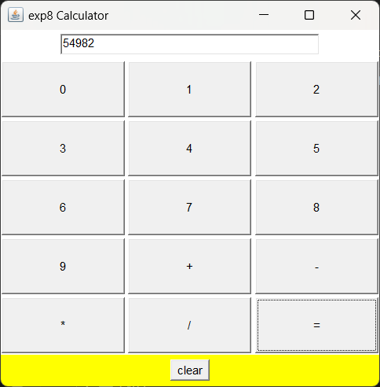
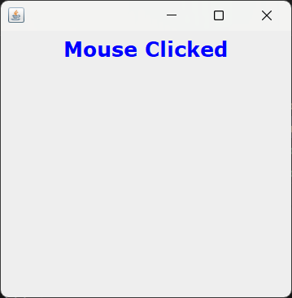

# List of Experiments

## 1. Use Eclipse or Net bean platform and acquaint yourself with the various menus. Create a test project, add a test class, and run it. See how you can use auto suggestions, auto fill. Try code formatter and code refactoring like renaming variables, methods, and classes. Try debug step by step with a small program of about 10 to 15 lines which contains at least one if else condition and a for loop.

### Source Code: `ex1.java` [view file](./exp1.java)
```java
import java.lang.System;
import java.util.Scanner;
class Experiment1 {
    public static void main(String args[]) { 
        int i,count=0,n;

        Scanner sc=new Scanner(System.in);
        System.out.print("Enter Any Number : ");
        n=sc.nextInt();
        
        for(i=1;i<=n;i++) { 
            if(n%i==0) { 
                count++; 
            } 
        } 
        if(count==2) 
            System.out.println(n+" is prime");
        else
            System.out.println(n+" is not prime");
    } 
}
```
### Output:
```bash
D:\java> javac .\exp1.java     
D:\java> java Experiment1  
Enter Any Number : 457
457 is prime
```

## 2. Write a Java program to demonstrate the OOP principles. [i.e., Encapsulation, Inheritance, Polymorphism and Abstraction]

### Source Code: `ex2.java` [view file](./exp2.java)
```java
class Person {
    private String name; // Encapsulation
    private int age; // Encapsulation

    public Person(String name, int age) {
        this.name = name;
        this.age = age;
    }
    public String getName() { // Abstraction
        return name;
    }
    public void setName(String name) {
        this.name = name;
    }
    public int getAge() { // Abstraction
        return age;
    }
    public void setAge(int age) {
        this.age = age;
    }
    public void displayInfo() { // Abstraction
        System.out.println("Name: " + name);
        System.out.println("Age: " + age);
    }
}
class Employee extends Person { // Inheritance
    private double salary;

    public Employee(String name, int age, double salary) {
        super(name, age);
        this.salary = salary;
    }
    public double getSalary() {
        return salary;
    }
    public void setSalary(double salary) {
        this.salary = salary;
    }
    public void displayInfo() { // Polymorphism
        super.displayInfo();
        System.out.println("Salary: " + salary);
    }
}

 class Experiment2 {
    public static void main(String[] args) {
        Person person = new Person("Purushottam", 20);
        System.out.println("Person Info:");
        person.displayInfo();
        System.out.println("====================");
       
        Person employee = new Employee("Harsh", 19, 10000);
        System.out.println("Employee Info:");
        employee.displayInfo();
        System.out.println("====================");
        
        employee.setName("Harsh RB");
        employee.setAge(20);
        System.out.println("Data Updated:");
        employee.displayInfo();
    }
}
```
### Output:
```bash
PS D:\java> javac .\exp2.java
PS D:\java> java Experiment2 
Person Info:
Name: Purushottam
Age: 20
====================
Employee Info:
Name: Harsh
Age: 19
Salary: 10000.0
====================
Data Updated:
Name: Harsh RB
Age: 20
Salary: 10000.0
```

## 3. Write a Java program to handle checked and unchecked exceptions. Also, demonstrate the usage of custom exceptions in real-time scenarios.

### Source Code: `ex3.java` [view file](./exp3.java)
```java
import java.io.File;
import java.io.FileReader;
import java.io.FileNotFoundException;

class InvalidAgeException extends Exception {
    public InvalidAgeException(String message) {
        super(message);
    }
}
class Experiment3 {
    public static void register(String name, int age) throws InvalidAgeException {
        if (age < 18) {
            throw new InvalidAgeException("User must be at least 18 years old.");
        } else {
            System.out.println("Registration successful for user: " + name);
        }
    }

    public static void main(String[] args) {
        try {
            File file = new File("myfile.txt");
            FileReader fr = new FileReader(file); 
        } catch (FileNotFoundException e) {
            System.out.println("File not found: " + e.getMessage());
        }

        try {   
            int[] arr = {1, 2, 3};
            System.out.println(arr[6]);
        } catch (ArrayIndexOutOfBoundsException e) {
            System.out.println("Array index out of bounds: " + e.getMessage());
        }
        finally {
            System.out.println("Cleanup operations can be performed here.");
        }

        System.out.println("Demonstrating Custom Exception:");
        try {
            register("Harsh RB", 18);
            register("Purushottam", 16);
        } catch (InvalidAgeException e) {
            System.out.println("Custom Exception Caught: " + e.getMessage());
        }
    }
}
```
### Output:

```bash
PS D:/JAVA> javac .\exp3.java
PS D:/JAVA> java Experiment3
File not found: myfile.txt (The system cannot find the file specified)
Array index out of bounds: Index 6 out of bounds for length 3
Cleanup operations can be performed here.
Demonstrating Custom Exception:
Registration successful for user: Harsh RB
Custom Exception Caught: User must be at least 18 years old.
```
## 4. Write a Java program on Random Access File class to perform different read and write operations.

### Source Code: `ex4.java` [view file](./exp4.java)

```java
import java.io.*;
class Experiment4 {
    public static void main(String[] args) {
    try {
        RandomAccessFile file = new RandomAccessFile("data.txt", "rw");
        String data1 = "Hello";
        String data2 = "World";
        file.writeUTF(data1);
        file.writeUTF(data2);

        file.seek(0);
        String readData1 = file.readUTF();
        String readData2 = file.readUTF();
        System.out.println("Data read from file:");
        System.out.println(readData1);
        System.out.println(readData2);

        file.seek(file.length());
        String newData = "Java!";
        file.writeUTF(newData);

        file.seek(0);
        readData1 = file.readUTF();
        readData2 = file.readUTF();

        String readData3 = file.readUTF();
        System.out.println("Data read from file after appending:");
        System.out.println(readData1);
        System.out.println(readData2);
        System.out.println(readData3);
        file.close();
    } catch (IOException e) {
        System.out.println("An error occurred: " + e.getMessage());
        e.printStackTrace();
    }
    }
}
```

### Output:

```bash
PS D:\java> javac .\exp4.java
PS D:\java> java Experiment4 
Data read from file:
Hello
World
Data read from file after appending:
Hello
World
Java!
```
## 5. Write a Java program to demonstrate the working of different collection classes. [Use package structure to store multiple classes].

### Source Code: [view folder](./exp5)

`CollectionsDemo.java` 
```java
package collections;
public class CollectionsDemo {
    public static void main(String[] args) {
        ListExample.main(args);
        SetExample.main(args);
        MapExample.main(args);
    }
}
```
`ListExample.java`
```java
package collections;
import java.util.ArrayList;
public class ListExample {
    public static void main(String[] args) {
        ArrayList<String> list = new ArrayList<>();
        list.add("Plums");
        list.add("Pineapple");
        list.add("Watermelon");
        System.out.println("List Example:");
        for (String fruit : list) {
            System.out.println(fruit);
        }
    }
}

```

`MapExample.java`
```java
package collections;
import java.util.HashMap;
public class MapExample {
    public static void main(String[] args) {
        HashMap<Integer, String> map = new HashMap<>();
        map.put(1, "Grape");
        map.put(2, "Strawberry");
        map.put(3, "Orange");
        System.out.println("Map Example:");
        for (HashMap.Entry<Integer, String> entry : map.entrySet()) {
        System.out.println(entry.getKey() + ": " + entry.getValue());
        }
    }
}
```

`SetExample.java`
```java
package collections;
import java.util.HashSet;
public class SetExample {
    public static void main(String[] args) {
        HashSet<String> set = new HashSet<>();
        set.add("Apple");
        set.add("Banana");
        set.add("Orange");
        set.add("Mango");
        System.out.println("Set Example:");
        for (String fruit : set) {
            System.out.println(fruit);
        }
    }
}
```

### Output:
```bash
D:\java\exp5> javac -d . ListExample.java
D:\java\exp5> javac -d . SetExample.java     
D:\java\exp5> javac -d . MapExample.java
D:\java\exp5> javac -d . CollectionsDemo.java
D:\java\exp5> java collections.CollectionsDemo  
List Example:
Plums
Pineapple
Watermelon
Set Example:
Apple
Mango
Orange
Banana
Map Example:
1: Grape
2: Strawberry
3: Orange
```

## 6. Write a program to synchronize the threads acting on the same object. [Consider the example of any reservations like railway, bus, movie ticket booking, etc.]

### Source Code: `exp6.java` [view file](./exp6.java)
```java
class TicketBookingSystem {
    private int availableTickets = 10; // Total tickets available

    // Method to book tickets, synchronized to handle concurrency
    public synchronized void bookTickets(String passengerName, int ticketsToBook) {
        if (ticketsToBook > availableTickets) {
            System.out.println("Sorry, " + passengerName + ". Not enough tickets available.");
            return;
        }

        // Simulating some delay to mimic real-world booking process
        try {
            Thread.sleep(100); // Introducing a small delay
        } catch (InterruptedException e) {
            e.printStackTrace();
        }

        // Booking tickets
        System.out.println(ticketsToBook + " ticket(s) booked for " + passengerName);
        availableTickets -= ticketsToBook;
        System.out.println("Remaining tickets: " + availableTickets);
    }
}

class TicketBookingExample {
    public static void main(String[] args) {
        TicketBookingSystem ticketSystem = new TicketBookingSystem();

        // Creating multiple threads to book tickets
        Thread thread1 = new Thread(() -> ticketSystem.bookTickets("Alice", 3));
        Thread thread2 = new Thread(() -> ticketSystem.bookTickets("Bob", 5));
        Thread thread3 = new Thread(() -> ticketSystem.bookTickets("Harsh", 4));
        Thread thread4 = new Thread(() -> ticketSystem.bookTickets("Carol", 2));

        // Start all threads
        thread1.start();
        thread2.start();
        thread3.start();
        thread4.start();

        // Wait for all threads to complete
        try {
            thread1.join();
            thread2.join();
            thread3.join();
            thread4.join();
        } catch (InterruptedException e) {
            e.printStackTrace();
        }
    }
}
```
### Output:
```bash
D:\Github\program-examples\resources\JAVA> java TicketBookingExample                                                                           
D:\Github\program-examples\resources\JAVA> javac exp6.java                                               
5 ticket(s) booked for Bob
Remaining tickets: 5
2 ticket(s) booked for Carol
Remaining tickets: 3
Sorry, Harsh. Not enough tickets available.
3 ticket(s) booked for Alice
Remaining tickets: 0
```

## 7. Write a program to perform CRUD operations on the student table in a database using JDBC.

### Source Code: `InsertData.java` [view file](./exp7/InsertData.java)
```java
import java.sql.*;
import java.util.Scanner;
public class InsertData {  
    public static void main(String[] args) {  
        try {  
            // to create connection with database
            Class.forName("com.mysql.jdbc.Driver");  
            Connection con = DriverManager.getConnection("jdbc:mysql://localhost/mydb", "root", "2424");  
            Statement s = con.createStatement();  
            
            // To read insert data into student table
            Scanner sc = new Scanner(System.in);
            System.out.println("Inserting Data into student table : ");  
            System.out.println("________________________________________");  
            System.out.print("Enter student id : ");
            int sid = sc.nextInt();
            System.out.print("Enter student name : ");
            String sname = sc.next();
            System.out.print("Enter student address : ");
            String saddr = sc.next();
            // to execute insert query
            s.execute("insert into student values("+sid+",'"+sname+"','"+saddr+"')"); 
            System.out.println("Data inserted successfully into student table");

            s.close(); 
            con.close(); 
        } catch (SQLException err) {  
            System.out.println("ERROR: " + err);  
        } catch (Exception err) {  
            System.out.println("ERROR: " + err);  
        }  
    }  
}  
```
### Source Code: `UpdateData.java` [view file](./exp7/UpdateData.java)
```java
import java.sql.*;
import java.util.Scanner;
public class UpdateData {  
    public static void main(String[] args) {  
        try {  
            // to create connection with database
            Class.forName("com.mysql.jdbc.Driver");  
            Connection con = DriverManager.getConnection("jdbc:mysql://localhost/mydb", "root", "2424");  
            Statement s = con.createStatement();  
            
            // To read insert data into student table
            Scanner sc = new Scanner(System.in);
            System.out.println("Update Data in student table : ");  
            System.out.println("________________________________________");  
            System.out.print("Enter student id : ");
            int sid = sc.nextInt();
            System.out.print("Enter student name : ");
            String sname = sc.next();
            System.out.print("Enter student address : ");
            String saddr = sc.next();
            // to execute update query
            s.execute("update student set s_name='"+sname+"',s_address = '"+saddr+"' where s_id = "+sid); 
            System.out.println("Data updated successfully");
            s.close(); 
            con.close(); 
        } catch (SQLException err) {  
            System.out.println("ERROR: " + err);  
        } catch (Exception err) {  
            System.out.println("ERROR: " + err);  
        }  
    }  
}  
```
### Source Code: `DeleteData.java` [view file](./exp7/DeleteData.java)
```java
import java.sql.*;
import java.util.Scanner;
public class DeleteData {  
    public static void main(String[] args) {  
        try {  
            // to create connection with database
            Class.forName("com.mysql.jdbc.Driver");  
            Connection con = DriverManager.getConnection("jdbc:mysql://localhost/mydb", "root", "");  
            Statement s = con.createStatement();  
            
            // To read insert data into student table
            Scanner sc = new Scanner(System.in);
            System.out.println("Delete Data from student table : ");  
            System.out.println("________________________________________");  
            System.out.print("Enter student id : ");
            int sid = sc.nextInt();
            // to execute delete query
            s.execute("delete from student where s_id = "+sid); 
            System.out.println("Data deleted successfully");
            s.close(); 
            con.close(); 
        } catch (SQLException err) {  
            System.out.println("ERROR: " + err);  
        } catch (Exception err) {  
            System.out.println("ERROR: " + err);  
        }  
    }  
}  
```
### Source Code: `DisplayData.java` [view file](./exp7/DisplayData.java)
```java
import java.sql.*;
import java.util.Scanner;
public class DisplayData {  
    public static void main(String[] args) {  
        try {  
            // to create connection with database
            Class.forName("com.mysql.jdbc.Driver");  
            Connection con = DriverManager.getConnection("jdbc:mysql://localhost/mydb", "root", "");  
            Statement s = con.createStatement();  
            
            // To display the data from the student table
            ResultSet rs = s.executeQuery("select * from student");  
            if (rs != null) {
            System.out.println("SID \t STU_NAME \t ADDRESS");
            System.out.println("________________________________________");
            while (rs.next())
            {  
                System.out.println(rs.getString(1) +" \t "+ rs.getString(2)+ " \t "+rs.getString(3));
                System.out.println("________________________________________");
            }  
            s.close(); 
            con.close(); 
            }
        } catch (SQLException err) {  
            System.out.println("ERROR: " + err);  
        } catch (Exception err) {  
            System.out.println("ERROR: " + err);  
        } 
        
    }  
}  
```
### Output:
```bash
C:\Users\harsh\Downloads\mysql-connector-j-8.4.0\mysql-connector-j-8.4.0>javac -cp .;mysql-connector-j-8.4.0.jar InsertData.java
C:\Users\harsh\Downloads\mysql-connector-j-8.4.0\mysql-connector-j-8.4.0>javac -cp .;mysql-connector-j-8.4.0.jar UpdateData.java
C:\Users\harsh\Downloads\mysql-connector-j-8.4.0\mysql-connector-j-8.4.0>javac -cp .;mysql-connector-j-8.4.0.jar DeleteData.java
C:\Users\harsh\Downloads\mysql-connector-j-8.4.0\mysql-connector-j-8.4.0>javac -cp .;mysql-connector-j-8.4.0.jar DisplayData.java

C:\Users\harsh\Downloads\mysql-connector-j-8.4.0\mysql-connector-j-8.4.0>java -cp .;mysql-connector-j-8.4.0.jar InsertData
Inserting Data into student table :
________________________________________
Enter student id : 91
Enter student name : Harsh
Enter student address : Lalapet
Data inserted successfully into student table

C:\Users\harsh\Downloads\mysql-connector-j-8.4.0\mysql-connector-j-8.4.0>java -cp .;mysql-connector-j-8.4.0.jar InsertData
Inserting Data into student table :
________________________________________
Enter student id : 115
Enter student name : Purushottam
Enter student address : Madapur
Data inserted successfully into student table

C:\Users\harsh\Downloads\mysql-connector-j-8.4.0\mysql-connector-j-8.4.0>java -cp .;mysql-connector-j-8.4.0.jar DisplayData
SID      STU_NAME        ADDRESS
________________________________________
91       Harsh   Lalapet
________________________________________
115      Purushottam     Madapur
________________________________________


C:\Users\harsh\Downloads\mysql-connector-j-8.4.0\mysql-connector-j-8.4.0>java -cp .;mysql-connector-j-8.4.0.jar UpdateData
Update Data in student table :
________________________________________
Enter student id : 91
Enter student name : HarshRB
Enter student address : Tarnaka
Data updated successfully

C:\Users\harsh\Downloads\mysql-connector-j-8.4.0\mysql-connector-j-8.4.0>java -cp .;mysql-connector-j-8.4.0.jar DeleteData
Delete Data from student table :
________________________________________
Enter student id : 115
Data deleted successfully

C:\Users\harsh\Downloads\mysql-connector-j-8.4.0\mysql-connector-j-8.4.0>java -cp .;mysql-connector-j-8.4.0.jar DisplayData
SID      STU_NAME        ADDRESS
________________________________________
91       HarshRB         Tarnaka
________________________________________
```

## 8. Write a Java program that works as a simple calculator. Use a grid layout to arrange buttons for the digits and for the +, -,*, % operations. Add a text field to display the result. Handle any possible exceptions like divided by zero.

### Source Code: `exp8.java` [view file](./exp8.java)
```java
import java.awt.*;
import java.awt.event.*;
import javax.swing.*;

@SuppressWarnings("removal")
public class exp8 extends Frame implements ActionListener {
    int num1, num2, result;
    TextField T1;
    Button NumButtons[] = new Button[10];
    Button Add, Sub, Mul, Div, clear, EQ;
    char Operation;
    Panel nPanel, CPanel, SPanel;

    public exp8() {
        nPanel = new Panel();
        T1 = new TextField(30);
        nPanel.setLayout(new FlowLayout(FlowLayout.CENTER));
        nPanel.add(T1);
        CPanel = new Panel();
        CPanel.setBackground(Color.white);
        CPanel.setLayout(new GridLayout(5, 5, 3, 3));
        for (int i = 0; i < 10; i++) {
            NumButtons[i] = new Button("" + i);
        }
        Add = new Button("+");
        Sub = new Button("-");
        Mul = new Button("*");
        Div = new Button("/");
        clear = new Button("clear");
        EQ = new Button("=");
        T1.addActionListener(this);
        for (int i = 0; i < 10; i++) {
            CPanel.add(NumButtons[i]);
        }
        CPanel.add(Add);
        CPanel.add(Sub);
        CPanel.add(Mul);
        CPanel.add(Div);
        CPanel.add(EQ);
        SPanel = new Panel();
        SPanel.setLayout(new FlowLayout(FlowLayout.CENTER));
        SPanel.setBackground(Color.yellow);
        SPanel.add(clear);
        for (int i = 0; i < 10; i++) {
            NumButtons[i].addActionListener(this);
        }
        Add.addActionListener(this);
        Sub.addActionListener(this);
        Mul.addActionListener(this);
        Div.addActionListener(this);
        clear.addActionListener(this);
        EQ.addActionListener(this);
        this.setLayout(new BorderLayout());
        add(nPanel, BorderLayout.NORTH);
        add(CPanel, BorderLayout.CENTER);
        add(SPanel, BorderLayout.SOUTH);
        setSize(400, 400);
        setTitle("exp8 Calculator");
        setVisible(true);
    }

    public void actionPerformed(ActionEvent ae) {
        String str = ae.getActionCommand();
        char ch = str.charAt(0);
        if (Character.isDigit(ch)) {
            T1.setText(T1.getText() + str);
        } else if (str.equals("+")) {
            num1 = Integer.parseInt(T1.getText());
            Operation = '+';
            T1.setText("");
        } else if (str.equals("-")) {
            num1 = Integer.parseInt(T1.getText());
            Operation = '-';
            T1.setText("");
        } else if (str.equals("*")) {
            num1 = Integer.parseInt(T1.getText());
            Operation = '*';
            T1.setText("");
        } else if (str.equals("/")) {
            num1 = Integer.parseInt(T1.getText());
            Operation = '/';
            T1.setText("");
        } else if (str.equals("=")) {
            num2 = Integer.parseInt(T1.getText());
            switch (Operation) {
                case '+':
                    result = num1 + num2;
                    break;
                case '-':
                    result = num1 - num2;
                    break;
                case '*':
                    result = num1 * num2;
                    break;
                case '/':
                    try {
                        result = num1 / num2;
                    } catch (ArithmeticException e) {
                        result = num2;
                        JOptionPane.showMessageDialog(this, "Divided by zero");
                    }
                    break;
            }
            T1.setText("" + result);
        } else if (str.equals("clear")) {
            T1.setText("");
        }
    }

    public static void main(String[] args) {
        exp8 app = new exp8();
        app.addWindowListener(new WindowAdapter() {
            public void windowClosing(WindowEvent we) {
                System.exit(0);
            }
        });
    }
}
```
### Output:
```bash
PS D:\Github\program-examples\resources\JAVA> javac exp8.java
PS D:\Github\program-examples\resources\JAVA> java exp8    

```

## 9. Write a Java program that handles all mouse events and shows the event name at the center of the window when a mouse event is fired. [Use Adapter classes]


### Source Code: `exp9.java` [view file](./exp9.java)
```java
import javax.swing.*;
import java.awt.*;
import javax.swing.event.*;
import java.awt.event.*;
class MouseEventPerformer extends JFrame implements MouseListener
{
 JLabel l1;
 public MouseEventPerformer()
 {
 setDefaultCloseOperation(JFrame.EXIT_ON_CLOSE);
 setSize(300,300);
 setLayout(new FlowLayout(FlowLayout.CENTER));
 l1 = new JLabel();
 Font f = new Font("Verdana", Font.BOLD, 20);
 l1.setFont(f);
 l1.setForeground(Color.BLUE);
 add(l1);
 addMouseListener(this);
 setVisible(true);
 }
public void mouseExited(MouseEvent m)
 {
 l1.setText("Mouse Exited");
 }
 public void mouseEntered(MouseEvent m)
 {
 l1.setText("Mouse Entered");
 }
 public void mouseReleased(MouseEvent m)
 {
 l1.setText("Mouse Released");
 }
 public void mousePressed(MouseEvent m)
 {
 l1.setText("Mouse Pressed");
 }
 public void mouseClicked(MouseEvent m)
 {
 l1.setText("Mouse Clicked");
 }
 public static void main(String[] args) {
 MouseEventPerformer mep = new MouseEventPerformer();
 }
}
```
### Output:
```bash
PS D:\Github\program-examples\resources\JAVA> javac .\exp9.java
PS D:\Github\program-examples\resources\JAVA> java MouseEventPerformer

```
