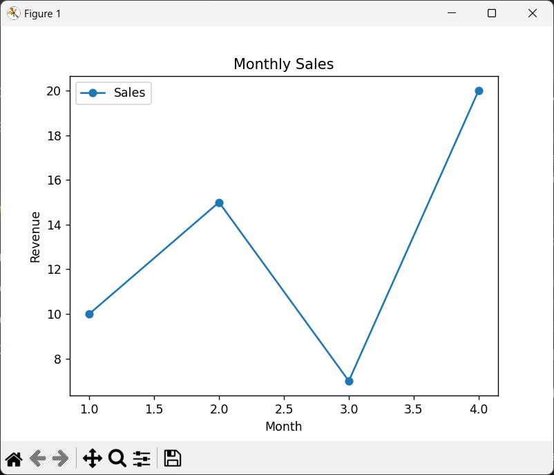
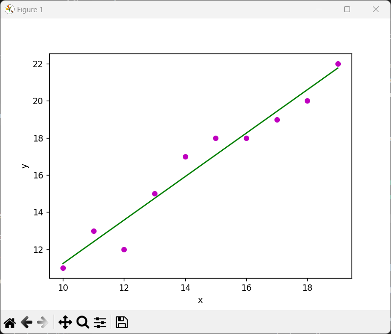
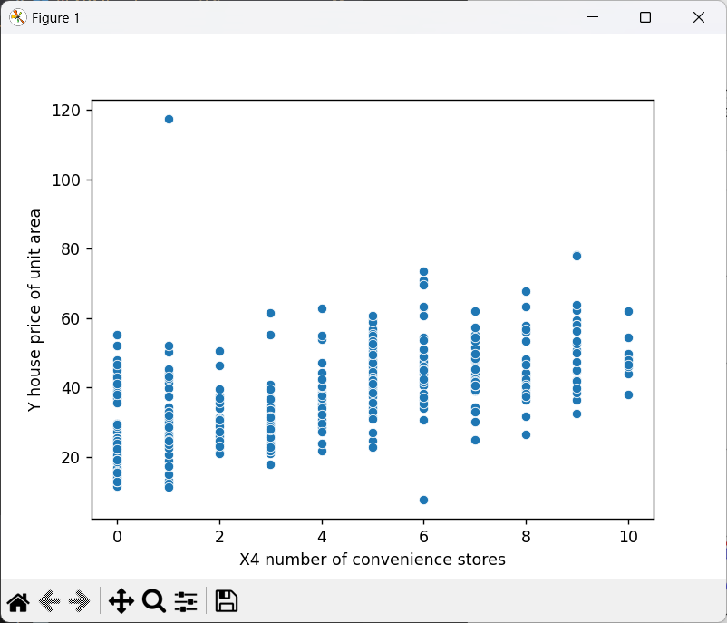
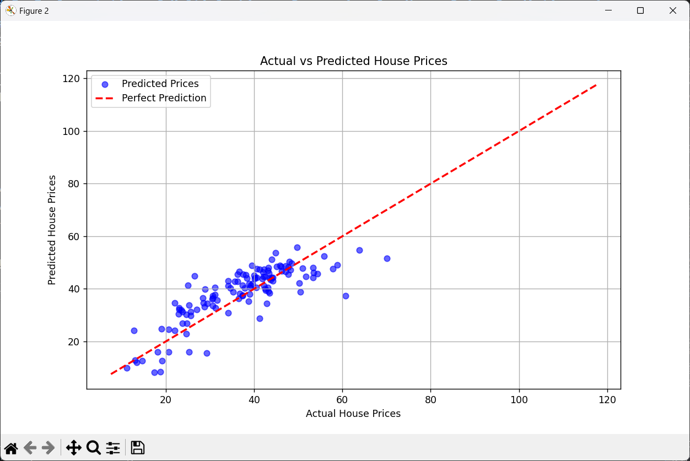

# 1. Python Program to Compute Central Tendency and Measures of Dispersion

### Central Tendency:
- **Mean**: The average of all numbers in a dataset.
- **Median**: The middle value in a sorted dataset.
- **Mode**: The most frequently occurring value in a dataset.

### Dispersion Measures:
- **Variance**: The measure of how far the data points spread out from the mean.
- **Standard Deviation**: The square root of the variance, representing data dispersion in the same units as the data.

### Python Code:
```python
import statistics

# Function to calculate mean
def calculate_mean(data):
    return sum(data) / len(data)

# Function to calculate median
def calculate_median(data):
    sorted_data = sorted(data)
    n = len(sorted_data)
    if n % 2 == 0:
        middle1 = sorted_data[n // 2 - 1]
        middle2 = sorted_data[n // 2]
        return (middle1 + middle2) / 2
    else:
        return sorted_data[n // 2]

# Function to calculate mode
def calculate_mode(data):
    return statistics.mode(data)

# Function to calculate variance
def calculate_variance(data):
    mean_value = calculate_mean(data)
    squared_diff_sum = sum((x - mean_value) ** 2 for x in data)
    return squared_diff_sum / (len(data) - 1)

# Function to calculate standard deviation
def calculate_standard_deviation(data):
    variance_value = calculate_variance(data)
    return variance_value ** 0.5

# Example dataset
dataset = [10, 20, 30, 40, 50]
mean_value = calculate_mean(dataset)
median_value = calculate_median(dataset)
mode_value = calculate_mode(dataset)
variance_value = calculate_variance(dataset)
std_deviation_value = calculate_standard_deviation(dataset)

# Print results
print(f"Dataset: {dataset}")
print(f"Mean: {mean_value:.2f}")
print(f"Median: {median_value:.2f}")
print(f"Mode: {mode_value}")
print(f"Variance: {variance_value:.2f}")
print(f"Standard Deviation: {std_deviation_value:.2f}")
```

### Output:
```
Dataset: [10, 20, 30, 40, 50]
Mean: 30.00
Median: 30.00
Mode: 10
Variance: 250.00
Standard Deviation: 15.81
```

---

# 2. Study of Python Basic Libraries

### 1. **Statistics**:
The `statistics` module provides functions to calculate mathematical statistics of numeric data. It offers simple methods to compute mean, median, mode, and other statistical measures.

#### Example:
```python
import statistics

data = [1, 2, 2, 3, 4]
mean_value = statistics.mean(data)
median_value = statistics.median(data)
mode_value = statistics.mode(data)

print(f"Mean: {mean_value}, Median: {median_value}, Mode: {mode_value}")
```
### Output:
```
Mean: 2.4, Median: 2, Mode: 2
```
### 2. **Math**:
The `math` module provides a wide range of mathematical functions like trigonometry, logarithms, square roots, and constants like `pi` and `e`.

#### Example:
```python
import math

# Square root
sqrt_value = math.sqrt(16)
print(f"Square root of 16: {sqrt_value}")

# Factorial
fact_value = math.factorial(5)
print(f"Factorial of 5: {fact_value}")

# Trigonometric functions (sin, cos, etc.)
sin_value = math.sin(math.radians(30))
print(f"Sine of 30 degrees: {sin_value.2f}")
```
### Output:
```
Square root of 16: 4.0
Factorial of 5: 120
Sine of 30 degrees: 0.50
```
### 3. **NumPy**:
NumPy is a fundamental package for numerical computing in Python. It provides support for arrays, matrices, and functions to operate on them efficiently.

#### Example:
```python
import numpy as np

# Create a 1D array
arr1d = np.array([1, 2, 3, 4, 5])
print(f"1D Array: {arr1d}")

# Compute mean and standard deviation using NumPy
mean = np.mean(arr1d)
std_dev = np.std(arr1d)
print(f"Mean: {mean}, Standard Deviation: {std_dev}")
```
### Output:
```
1D Array: [1 2 3 4 5]
Mean: 3.0, Standard Deviation: 1.4142135623730951
```
### 4. **SciPy**:
SciPy builds on NumPy and provides functions for optimization, integration, interpolation, and other scientific computing tasks.

#### Example:
```python
from scipy import integrate

# Function to integrate
def integrand(x):
    return x**2

# Perform integration
result, error = integrate.quad(integrand, 0, 3)
print(f"Integral result from 0 to 3: {result:.2f}")
```
### Output:
```
Integral result from 0 to 3: 9.00
```
---
# 3. Study of Python Libraries for ML Applications: Pandas and Matplotlib

#### 1. **Pandas:**
Pandas is an essential library for data manipulation and analysis in Python. It provides two main data structures: `DataFrame` and `Series`, which allow efficient handling of structured data.

- **Key Features:**
  - **Data Cleaning:** Helps in cleaning, transforming, and preprocessing raw data.
  - **Data Exploration:** Allows easy exploration, filtering, and aggregation of datasets.
  - **Missing Data Handling:** Provides functions for handling missing values efficiently.
  - **Integration with ML Libraries:** Seamlessly integrates with ML libraries like Scikit-learn and TensorFlow.

- **Example:**
```python
import pandas as pd

# Create a DataFrame
data = {'Name': ['Harsh', 'Kalyan', 'Deepika', 'Abhigna'], 'Marks': [91, 95, 87, 85]}
df = pd.DataFrame(data)

# Display the DataFrame
print(df)
```
### Output:
```
      Name  Marks
0    Harsh     91
1   Kalyan     95
2  Deepika     87
3  Abhigna     85
```
#### 2. **Matplotlib:**
Matplotlib is a powerful library for creating static, animated, and interactive visualizations in Python. It is widely used for plotting data and generating charts in ML applications.

- **Key Features:**
  - **Variety of Plots:** Supports line plots, scatter plots, bar charts, histograms, etc.
  - **Customization:** Allows control over plot colors, labels, legends, and titles.
  - **Integration with Pandas:** Works well with Pandas DataFrames for direct plotting.

- **Example:**
```python
import matplotlib.pyplot as plt

# Sample data
x = [1, 2, 3, 4]
y = [10, 15, 7, 20]

# Create a line plot
plt.plot(x, y, marker='o', label='Sales')

plt.xlabel('Month')
plt.ylabel('Revenue')
plt.title('Monthly Sales')
plt.legend()

# Show the plot
plt.show()
```
### Output:


Both Pandas and Matplotlib are essential for handling data in machine learning workflows. Pandas helps manipulate and analyze data, while Matplotlib helps visualize results, making them invaluable in ML projects.

---

# 4. Python Program for Simple Linear Regression

**Simple Linear Regression** aims to model the relationship between a dependent variable (`y`) and one independent variable (`x`) using a straight line.

- **Steps:**
  1. Define feature (`x`) and response (`y`) vectors.
  2. Estimate regression coefficients using the least squares method.
  3. Plot the regression line against the data.

- **Code:**
```python
import numpy as np
import matplotlib.pyplot as plt

# Function to estimate coefficients
def estimate_coeff(x, y):
    n = np.size(x)
    m_x, m_y = np.mean(x), np.mean(y)
    
    SS_xy = np.sum(y * x) - n * m_y * m_x
    SS_xx = np.sum(x * x) - n * m_x * m_x
    
    b_1 = SS_xy / SS_xx
    b_0 = m_y - b_1 * m_x
    
    return (b_0, b_1)

# Function to plot regression line
def plot_regression_line(x, y, b):
    plt.scatter(x, y, color = "m", marker = "o", s = 30)
    y_pred = b[0] + b[1] * x
    plt.plot(x, y_pred, color = "g")
    plt.xlabel('x')
    plt.ylabel('y')
    plt.show()

# Main function to run the program
def main():
    # Data points
    x = np.array([10, 11, 12, 13, 14, 15, 16, 17, 18, 19])
    y = np.array([11, 13, 12, 15, 17, 18, 18, 19, 20, 22])

    # Estimate coefficients
    b = estimate_coeff(x, y)
    print(f"Estimated coefficients:\nb_0 = {b[0]}, b_1 = {b[1]}")

    # Plot regression line
    plot_regression_line(x, y, b)

if __name__ == "__main__":
    main()
```
### Output:
```
Estimated coefficients:
b_0 = -0.4606060606060609, b_1 = 1.1696969696969697
```


---
# 5. Implementation of Multiple Linear Regression for House Price Prediction using sklearn

### Process:

1. **Import Required Libraries:**
   You start by importing necessary libraries like `pandas`, `numpy`, `sklearn`, and visualization libraries (`matplotlib`, `seaborn`).

2. **Load Dataset:**
   You read the house price data from a CSV file, and drop unnecessary columns (like 'No'). After that, a glimpse of the first five rows of the dataset is displayed.

3. **Visualize Data:**
   A scatter plot is created to visualize the relationship between the number of convenience stores near the house and the house price.

4. **Prepare Data for Training:**
   Feature variables (`X`) and the target variable (`y`) are separated. In this case, the independent variables (features) are columns starting with 'X', and the dependent variable (target) is 'Y house price of unit area'.

5. **Train-Test Split:**
   The dataset is split into training and testing sets using `train_test_split()`. 70% of the data is used for training, and 30% for testing, with a `random_state` set for reproducibility.

6. **Create and Train the Model:**
   You create a `LinearRegression` model and train it with the training data using the `fit()` method.

7. **Make Predictions:**
   After the model is trained, predictions are made on the test dataset using the `predict()` method.

8. **Evaluate the Model:**
   The model is evaluated using two error metrics:
   - **Mean Squared Error (MSE):** Measures the average of the squares of the errors.
   - **Mean Absolute Error (MAE):** Measures the average of the absolute differences between predicted and actual values.

### Code:

```python
# Importing necessary libraries
import pandas as pd
import numpy as np
import matplotlib.pyplot as plt
import seaborn as sns
from sklearn.model_selection import train_test_split
from sklearn.linear_model import LinearRegression
from sklearn.metrics import mean_squared_error, mean_absolute_error

# Load dataset
df = pd.read_csv('Real estate.csv')
df.drop('No', inplace=True, axis=1)

# Print dataset information
print(df.head())
print(df.columns)

# Visualize data with a scatterplot
sns.scatterplot(x='X4 number of convenience stores', y='Y house price of unit area', data=df)

# Prepare feature variables
X = df.drop('Y house price of unit area', axis=1)
y = df['Y house price of unit area']

# Train-test split
X_train, X_test, y_train, y_test = train_test_split(X, y, test_size=0.3, random_state=101)

# Create and train model
model = LinearRegression()
model.fit(X_train, y_train)

# Make predictions
predictions = model.predict(X_test)

# Evaluate the model
print('Mean Squared Error:', mean_squared_error(y_test, predictions))
print('Mean Absolute Error:', mean_absolute_error(y_test, predictions))

# Create a scatter plot for actual vs predicted prices
plt.figure(figsize=(10, 6))
plt.scatter(y_test, predictions, alpha=0.6, color='blue', label='Predicted Prices')
plt.plot([y.min(), y.max()], [y.min(), y.max()], 'r--', lw=2, label='Perfect Prediction')  # y = x line
plt.title('Actual vs Predicted House Prices')
plt.xlabel('Actual House Prices')
plt.ylabel('Predicted House Prices')
plt.legend()
plt.grid()
plt.show()

```

### Output:
```
PS D:\Github\program-examples\resources\ML> python .\5.py
   X1 transaction date  X2 house age  X3 distance to the nearest MRT station  ...  X5 latitude  X6 longitude  Y house price of unit area
0             2012.917          32.0                                84.87882  ...     24.98298     121.54024                        37.9
1             2012.917          19.5                               306.59470  ...     24.98034     121.53951                        42.2
2             2013.583          13.3                               561.98450  ...     24.98746     121.54391                        47.3
3             2013.500          13.3                               561.98450  ...     24.98746     121.54391                        54.8
4             2012.833           5.0                               390.56840  ...     24.97937     121.54245                        43.1

[5 rows x 7 columns]
Index(['X1 transaction date', 'X2 house age',
       'X3 distance to the nearest MRT station',
       'X4 number of convenience stores', 'X5 latitude', 'X6 longitude',
       'Y house price of unit area'],
      dtype='object')
Mean Squared Error: 46.211797834927665
Mean Absolute Error: 5.392293684755756
```



